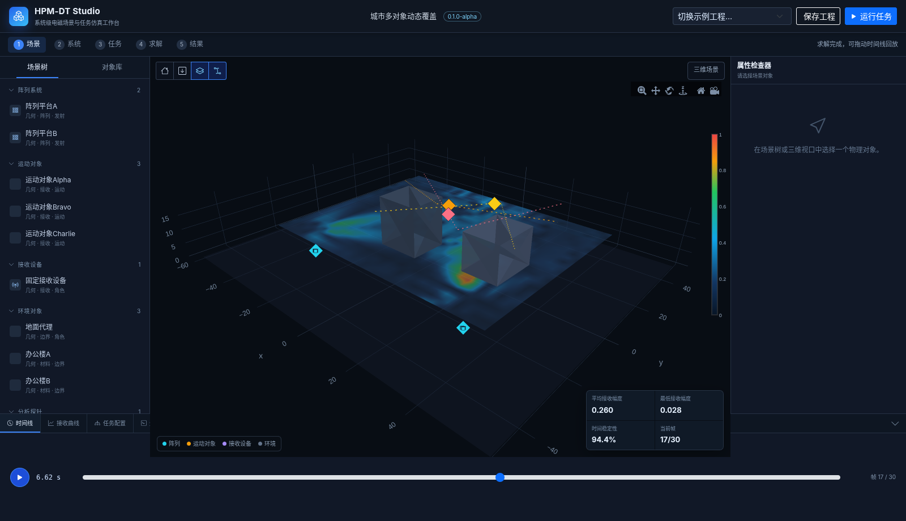
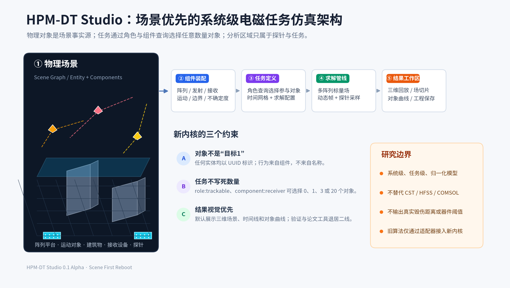

# HPM-DT Studio 0.1 Alpha

**HPM-DT Studio** 是面向高功率微波、相控阵和复杂电磁环境研究的**系统级场景与任务仿真工作台**。

本项目不是给旧验证后台换皮，而是从领域模型开始重启：

```text
物理对象 → 系统组件 → 任务选择 → 数值求解 → 三维回放 → 工程保存
```



## 为什么重做

旧项目把 `TargetRegion`、`ProtectedZone` 和 `ObservationPlane` 当作世界本身，因此“三维场景”实际上只是若干手工区域的控场演示。

新内核改为：

- 阵列平台、运动对象、建筑、接收设备和探针均为通用物理实体；
- 实体通过组件组合获得阵列、发射、接收、运动、边界等能力；
- 任务通过 `role:` 与 `component:` 查询选择任意数量对象；
- “目标区/保护区”不再是场景主对象；
- 默认结果是三维场景、时间线、动态场切片和对象曲线，而不是评分和审计表。



## 当前可运行闭环

默认“城市多对象动态覆盖”示例包含：

- 2个阵列平台；
- 3个独立运动对象；
- 2栋建筑；
- 1个地面代理；
- 1个固定接收设备；
- 1个平面场探针；
- 30个动态时间帧。

用户可以：

1. 新建、打开或切换示例工程；
2. 从对象库添加任意数量阵列平台、运动对象、建筑、接收设备或场探针；
3. 在属性检查器修改对象位置和旋转；
4. 运行多阵列、多接收器动态任务；
5. 拖动或播放时间线；
6. 查看动态场切片和各接收实体曲线；
7. 保存或重新打开 `.hpmdt` 工程。

## 快速启动

```bash
python -m pip install -r requirements.txt
python run_studio.py
```

访问：

```text
http://127.0.0.1:7869
```

也可以安装后启动：

```bash
python -m pip install -e .
hpmdt-studio
```

## 测试

```bash
PYTHONPATH=src pytest -q
```

当前结果：

```text
18 passed
```

## 工程格式

`.hpmdt` 是ZIP容器，包含：

```text
manifest.json
metadata/project.json
scene/scene.json
missions/*.json
results/index.json
results/*.json
```

详见 [PROJECT_FORMAT.md](PROJECT_FORMAT.md)。

## 代码结构

```text
src/hpmdt/domain          通用实体、组件和任务模型
src/hpmdt/solvers         多实体快速求解器
src/hpmdt/application     工作区与对象工厂
src/hpmdt/infrastructure  .hpmdt工程存储
src/hpmdt/api             FastAPI接口
src/hpmdt/frontend        全中文场景工作台
examples                  可复用示例工程
tests                     回归测试
```

## 研究边界

- 当前后端是归一化自由空间标量格林函数快速模型；
- 建筑在0.1版本中具有场景和可视化语义，尚未进入反射求解；
- 不替代 CST、HFSS 或 COMSOL；
- 不输出真实源功率、真实作用距离、现实器件阈值或现实毁伤概率；
- 0.1 Alpha 是新主干的可运行垂直切片，不冒充最终完整CAE产品。

## 下一阶段

0.2 Alpha 重点是将三维编辑视口升级为 Three.js 场景图与 TransformControls，加入真正的对象移动、旋转、缩放、撤销/重做和 glTF/GLB 模型导入。详见 [ROADMAP.md](ROADMAP.md)。

Codex 后续开发必须先阅读 [CODEX_HANDOFF.md](CODEX_HANDOFF.md)。
